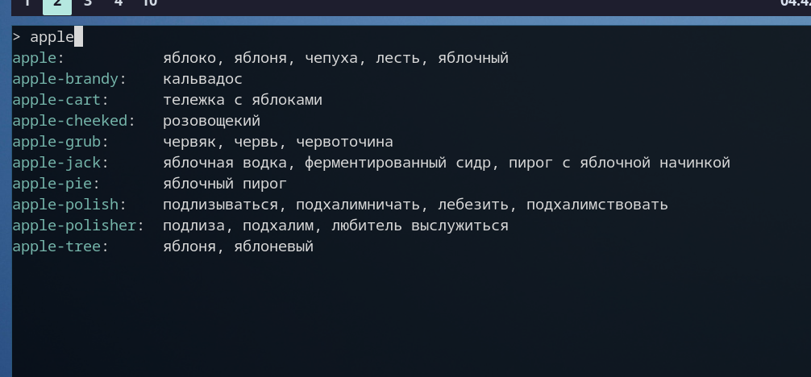
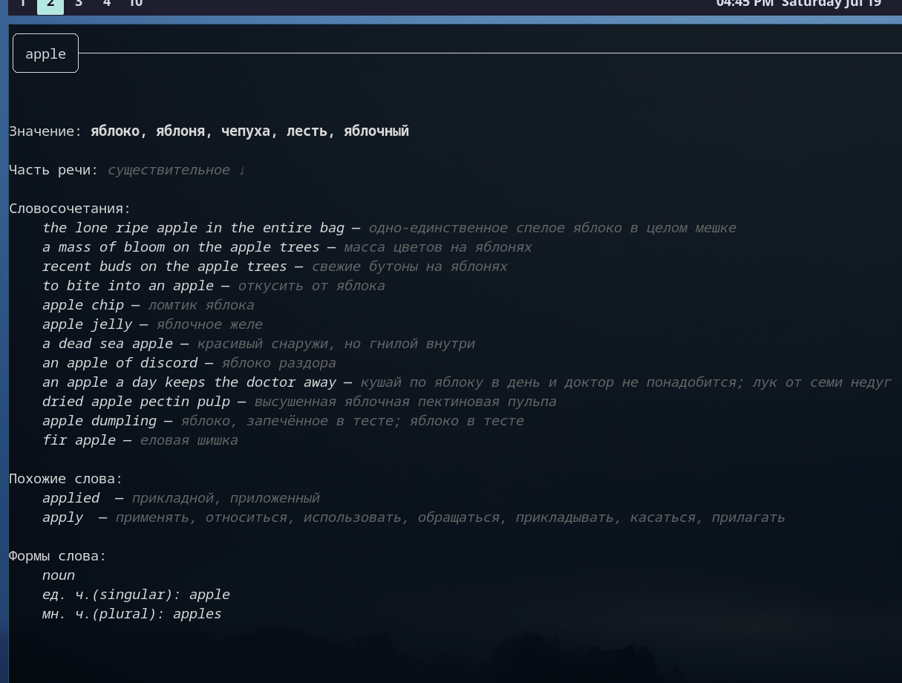

# Wooordhunt CLI - cli for wooordhunt.ru

## Screenshots

## Build and install

    git clone https://github.com/iv4n-t3a/wooordhunt-cli
    cd wooordhunt-cli

  Only build:

    make

  Install

    make install

  If had issues consider you have ~/.local/bin/ in PATH.

## Configuration

  For configuration edit ~/.config/wh/config.json or check `wh --help` for command line options

  Also following locations of config are supported

  - ./config/config.json
  - ~/.config/wh/config.json
  - ~/.config/wooordhunt-cli/config.json
  - /etc/wh/config.json
  - /etc/wooordhunt-cli/config.json

## Plans

- Add support for other online-dictionaries
- Add local caching
- Add revice mode
